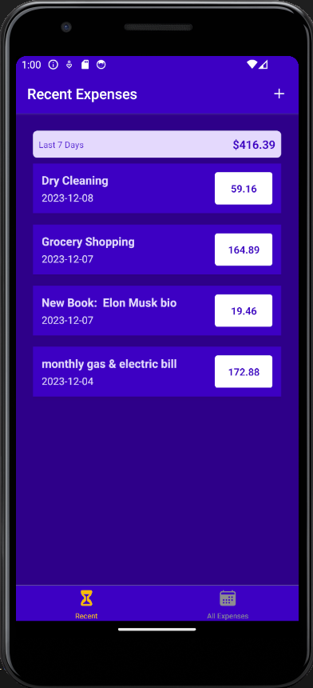
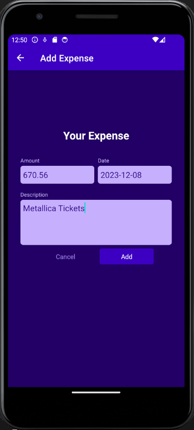

# Expense Tracker - React Native 

  ## Description

  An expense tracker mobile application (for iOS/Andriod) that allows a User to enter expenses via a form.  There is a view for both Recent expenses (past 7 days) and for All Expenses.  Individual expense items can be modified or deleted.  This project was build using React-Native, React-Navigation, React Context API, and Firebase database.

  ### App Screenshots
  
  
  
  ## Table of Contents
  
  - [Installation](#installation)
  - [Usage](#usage)
  - [License](#license)
  - [Contributing](#contributing)
  - [Tests](#tests)
  - [Questions](#questions)
  
  ## Installation
  
  npm install
  
  ## Usage
  
  Click the "+" button to add a new expense entering the date, amount, and description.  Toggle between "Recent" and "All Expenses" using bottom tab navigation - each view will show a sum of the expenses as well as the individual expense items for that view.  If you click on the individual expense item, a modal will pop up which where you will have the option of editing or deleting the expense item, or canceling out of the modal screen.

  ## License
This application is covered under the MIT License.
 For more information: https://opensource.org/licenses/MIT
  
  ## Contributing
  N/A
  
  ## Tests
  N/A

  ## Questions
  Contact Info 
  GitHub user name: BillStephens2022 
  Link to GitHub profile: https://github.com/BillStephens2022 
  Email: stephensbill17@gmail.com

